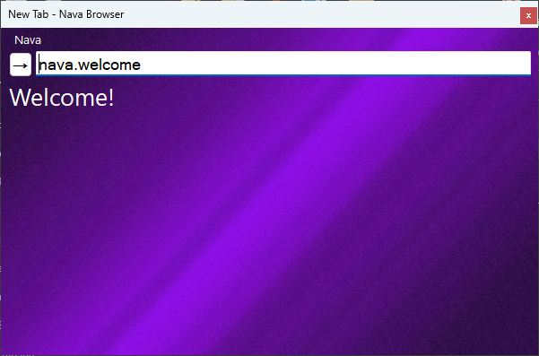
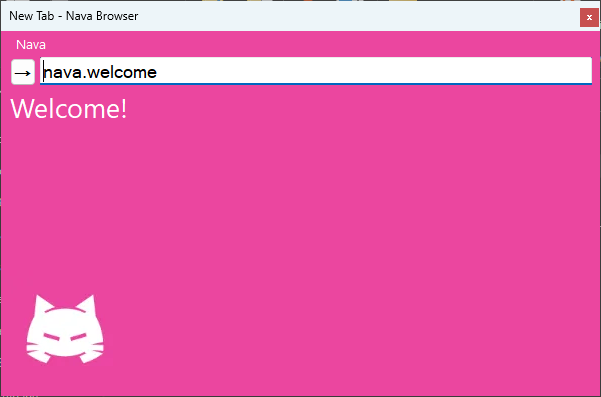

> [!IMPORTANT]  
> This project was made without using Chromium, Firefox source code.

# Nava Browser
Welcome to the *greatest browser ever lived* which is Nava Browser!

# Avaiable Sites (nava.)
`nava.wjtzil` - About <a href="https://github.com/WJTZIL">WJTZIL</a>.

## Features

Search Engine (NavaWeb) 
Built in C# (on scratch.)

Lock Screen 
However the password to lock screen is always a last site 
before the browser is locked.
